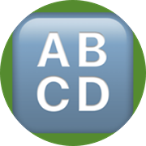

# Simple Spelling Correction Api

> 🏄  **You can deploy this api completely free for any purpose and without limits on Deta.Sh** Just click the link below 🛠️  
>   

> Simple, reliable and free Spelling Correction Api. 
> 
> 🔍 Check it on [https://SpellingCorrectionApi.deta.dev](https://SpellingCorrectionApi.deta.dev "https://SpellingCorrectionApi.deta.dev")  **without any limits 😈**
> 
> ⏩ Example Usage:  [https://SpellingCorrectionApi.deta.dev/correct-sentence?sentence=hi%20how%20arw%20yom%3F%20thid%20is%20my%20tesy](https://SpellingCorrectionApi.deta.dev/correct-sentence?sentence=hi%20how%20arw%20yom%3F%20thid%20is%20my%20tesy)

## Features and Advantages
* ✅ Simple and powerfull for any type of app
* 🐳 Capable of handling over millions of requests per day.
* 📝 Correct any word, sentence or paragraph easily.
* 🏎️ Get response in milliseconds.
* 💻 Serverless so yo don't have to hassle with servers.

## For Demo:
* Just go to: [https://SpellingCorrectionApi.deta.dev](https://SpellingCorrectionApi.deta.dev)

### [📝 Test It Now With a Simple Request](https://SpellingCorrectionApi.deta.dev/correct-sentence?sentence=hi%20how%20arw%20yom%3F%20thid%20is%20my%20tesy)

## Use Cases
* Everywhere you get user input.

## Deployment
* It's not rocket science. Just click the button below  ⬇️  

### Check Api Documantation below: ⬇️

> **_Swagger UI:_**  [https://SpellingCorrectionApi.deta.dev/docs](https://SpellingCorrectionApi.deta.dev/docs "https://SpellingCorrectionApi.deta.dev/docs")

> **_ReDoc:_** [https://SpellingCorrectionApi.deta.dev/redoc](https://SpellingCorrectionApi.deta.dev/redoc "https://SpellingCorrectionApi.deta.dev/redoc")

## Credits
* This api made possible thanks to [textblob](https://textblob.readthedocs.io/en/dev/)

## Contributing  

> Feel Free to contribute and add anything you want 😊  
> I'm checking pull requests daily. 

